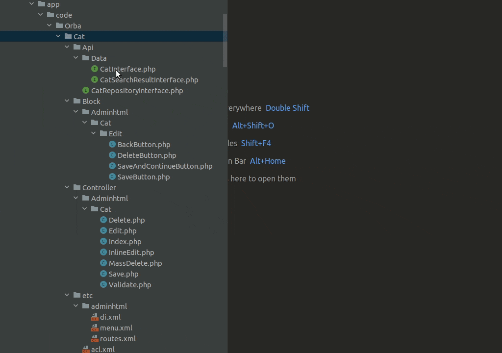

# Magento 2 Code Generator

Created by [Lingaro](https://lingarogroup.com)

Inspired by https://github.com/staempfli/magento2-code-generator

## Purpose

In day-to-day Magento 2 development there are some common tasks which require development of repeatable code that is hard to simply copy-paste.
The purpose of this app is to automatize creation of such code, so the developers may focus on business logic and thanks to that being much more efficient and happy.

There are other tools on the market that allows to generate Magento boilerplate code, but we went a step further.
The unique value of our tool is that it can be used with already existing codebase.
The code generated by the tool is automatically merged with current code (eg. configuration XML files, requirejs-config JS files, etc.).
Also, our aim was to generate high-quality code that uses modern PHP features and Magento coding standards.

## Demo

New entity with all admin CRUD actions in just a minute? Why not ;-)

### Console command


### Generated code



### Admin panel


## Supported Magento versions

* 2.3.7
* 2.4.0
* 2.4.1
* 2.4.2
* 2.4.3
* 2.4.4

Watchout: Minimal version of Magento's PHP is 7.4.

## Available templates

`apiEndpoint` - creates an API endpoint

`block` - creates a block and phtml template file for it

`cache` - creates a cache type

`categoryAttributes` - creates data patches which add custom attributes to category entity along with ui_component needed to render these attributes

`configField` - creates config field for already existent group of store configuration

`configGroup` - creates group for already existent section of store configuration

`configSection` - creates section in existent tab of store configuration

`configTab` - creates tab for store configuration

`consoleCommand` - creates a console command

`cron` - creates a cron job and (optionally) a cron group

`crud` - creates new entity and all CRUD actions in the admin panel for it

`customerAttributes` - creates data patches which add custom attributes to customer entity

`emailTemplate` - creates a system e-mail template with class for sending it and config for allowing admin to customize it

`eventObserver` - creates event observer for given event

`frontPageController` - creates a frontend controller that renders custom page

`frontPostController` - creates a very basic front POST controller

`importEntity` - creates an import model to import data into your custom entity table

`jsMixin` - creates a JS mixin

`jsModule` - creates a JS module

`model` - creates a model with the corresponding repository, searchResult, resourceModel, collection, db_schema.xml and APIs

`module` - creates basic configuration needed to start a custom module

`productAttributes` - creates data patch which adds custom attributes to product entity

`queueMessage` - creates queue message with publisher and handler using AMQP connection

`quoteFields` - creates custom fields for quote and order

`searchCriteriaUsage` - creates a management class and search criteria usage

`theme` - creates basic configurations needed to start a custom theme

`viewModel` - creates a view model and phtml template file for it

`widget` - creates a widget

## Installation

Recommended way to install this app is to add it as Magento's Composer dev dependency:

```
composer require --dev lingaro/magento2-codegen
```

If you don't want to attach this app to your Magento, you can also simply clone the repository and use it as a standalone library.
Don't forget to run `composer install` to install all required dependencies.

## Configuration

Create your custom config file (not needed for Lingaro developers) either in package `config` directory or in your Magento root directory:

```
cp vendor/lingaro/magento2-codegen/config/codegen.yml.dist vendor/lingaro/magento2-codegen/config/codegen.yml
```
or
```
cp vendor/lingaro/magento2-codegen/config/codegen.yml.dist codegen.yml
```

and edit default values.

You may add your own template directory by including the following in your `codegen.yml`: 

```
templateDirectories:
  - { path: "path/to/templates" }
```

Template folder `path` must be relative to package directory, ex. if you want to add private templates to your Magento `dev` folder, you should use `../../../dev/codegen_templates` path.

You may include multiple template directories.

To overwrite a core template just copy a core template to your template directory and make changes as necessary.

## Usage

1. List all templates:

```
bin/codegen template:list
```

2. Show template info:

```
bin/codegen template:info <template>
```

3. Generate template:

```
bin/codegen template:generate <template>
```

For templates which type is `module` (most of them) this command must be executed on the module root folder where the `registration.php` file is.

For templates which type is `root` this command must be executed on the Magento root folder.

Example:

```
cd /path/to/magento/app/code/Lingaro/TestModule
../../../../vendor/bin/codegen template:generate block
```

3.1. Options

| Long name        | Short name | Description                                                                                                               | Example                                                                                                      |
|------------------|------------|---------------------------------------------------------------------------------------------------------------------------|--------------------------------------------------------------------------------------------------------------|
| --root-dir       | -r         | If specified, code is generated on this root directory. If the directory doesn't exist, it will be created automatically. | `bin/codegen -r"/var/www/magento/app/code/Lingaro/TestModule" template:generate block`                       |
| --force-merge    | -m         | Use "all" to automatically run all code mergers. Use "experimental" to automatically run non-experimental code mergers.   | `bin/codegen template:generate -mall block`                                                                  |
| --force-override | -o         | If specified, all unmerged files will be automatically overridden.                                                        | `bin/codegen template:generate -o block`                                                                     |
| --yaml-path      | -y         | If specified, property values will be collected from YAML file instead of console prompts.                                | `bin/codegen -y"lib/internal/codegen/templates/block/.no-copied-config/example.yml" template:generate block` |


## Contribution

Feel free to contribute with new templates, bugfixes and features. Submit your code to review using pull request.

Be aware that we require all the code to be compatible with PSR12.
Also, we are validating the code with the following PHPMD rule sets:
cleancode, codesize, controversial, design, unusedcode.

In [dev/docs.md](dev/docs.md) you can find the additional documentation for developers.
